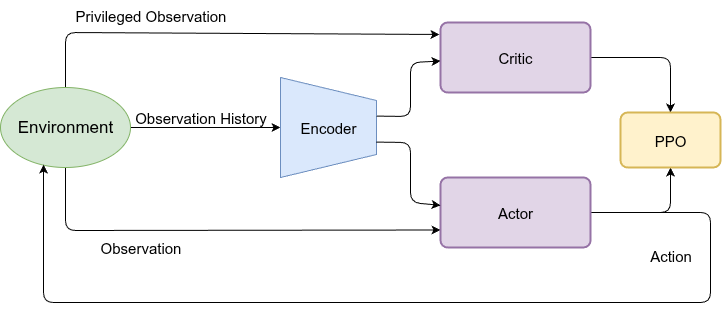

# 双足机器人强化学习运动学习项目 / Bipedal Robot RL Locomotion Learning Project

[](https://docs.omniverse.nvidia.com/isaacsim/latest/overview.html)
[](https://isaac-sim.github.io/IsaacLab)
[](https://docs.python.org/3/whatsnew/3.10.html)
[](https://releases.ubuntu.com/20.04/)
[](https://www.microsoft.com/en-us/)
[](https://pre-commit.com/)
[](https://opensource.org/license/mit)

## 概述 / Overview

该仓库用于训练和仿真双足机器人，例如[limxdynamics TRON1](https://www.limxdynamics.com/en/tron1)。
借助[Isaac Lab](https://github.com/isaac-sim/IsaacLab)框架，我们可以训练双足机器人在不同环境中行走，包括平地、粗糙地形和楼梯等。

This repository is used to train and simulate bipedal robots, such as [limxdynamics TRON1](https://www.limxdynamics.com/en/tron1).
With the help of [Isaac Lab](https://github.com/isaac-sim/IsaacLab), we can train the bipedal robots to walk in different environments, such as flat, rough, and stairs.

**关键词 / Keywords:** isaaclab, locomotion, bipedal, pointfoot, TRON1

## 安装 / Installation

- 【非官方】强烈推荐使用一键安装脚本(pip)！

   本脚本同时支持Isaacsim v1.4.1和v2.x.x版本。一键脚本可直接安装Isaacsim、Isaaclab以及配套miniconda虚拟环境，已在ubuntu22.04与20.04测试通过，在终端中执行以下命令：
   ```bash
   wget -O install_isaaclab.sh https://docs.robotsfan.com/install_isaaclab.sh && bash install_isaaclab.sh
   ```

   感谢一键安装脚本作者[@fan-ziqi](https://github.com/fan-ziqi)，感谢大佬为机器人社区所做的贡献。该仓库所使用Isaacsim版本为2.1.0，使用一键脚本安装时请选择该版本。

- 【官方】Isaaclab官网安装
  Install Isaac Lab by following the [installation guide](https://isaac-sim.github.io/IsaacLab/v2.1.0/source/setup/installation/binaries_installation.html). We recommend using the conda installation as it simplifies calling Python scripts from the terminal. 


- 将仓库克隆到Isaac Lab安装目录之外的独立位置（即在`IsaacLab`目录外）：

  Clone the repository separately from the Isaac Lab installation (i.e. outside the `IsaacLab` directory):

```bash
# 选项 1: HTTPS / Option 1: HTTPS
git clone http://8.141.22.226/Bobbin/limxtron1lab.git

# 选项 2: SSH
git clone git@8.141.22.226:Bobbin/limxtron1lab.git
```

```bash
# Enter the repository
conda activate isaaclab
cd bipedal_locomotion_isaaclab
```

- Using a python interpreter that has Isaac Lab installed, install the library

```bash
python -m pip install -e exts/bipedal_locomotion
```

- 为了使用MLP分支，需要安装该库 / To use the mlp branch, install the library

```bash
cd bipedal_locomotion_isaaclab/rsl_rl
python -m pip install -e .
```

## IDE设置（可选）/ Set up IDE (Optional)

要设置IDE，请按照以下说明操作：
To setup the IDE, please follow these instructions:

- 将.vscode/settings.json中的路径替换成使用者所使用的Isaaclab和python路径，这样当使用者对Isaaclab官方函数或变量进行检索的时候，可以直接跳入配置环境代码的定义。

- Replace the path in .vscode/settings.json with the Isaaclab and python paths used by the user. This way, when the user retrieves the official functions or variables of Isaaclab, they can directly jump into the definition of the configuration environment code.

## 模型文件说明 / Model Files

本项目提供了多个训练好的模型权重文件，位于 `logs/rsl_rl/pf_tron_1a_flat/` 目录下：

This project provides multiple trained model weight files located in the `logs/rsl_rl/pf_tron_1a_flat/` directory:

### 推荐模型 / Recommended Models

- **最佳模型（推荐用于所有演示和测试）/ Best Model (Recommended for all demos and tests)**:
  ```
  logs/rsl_rl/pf_tron_1a_flat/2026-01-08_14-51-48_improve_gait/model_4400.pt
  ```
  该模型在平地、复杂地形和楼梯环境中都表现优异，具有良好的速度跟踪能力和稳定的步态表现。
  This model performs excellently on flat ground, rough terrain, and stairs, with good velocity tracking capability and stable gait performance.


导出的ONNX模型（用于部署）位于 `output/play/` 目录下，包括：
Exported ONNX models (for deployment) are located in the `output/play/` directory, including:

- `output/play/2026-01-08_14-51-48_improve_gait/exported/policy.onnx`
- `output/play/2026-01-08_14-51-48_improve_gait/exported/encoder.onnx`

## 快速开始：复现演示结果 / Quick Start: Reproducing Demo Results

### 步骤1：环境准备 / Step 1: Environment Setup

确保已经按照上述"安装 / Installation"部分完成了环境配置。
Make sure you have completed the environment setup according to the "Installation" section above.

```bash
# 激活Isaac Lab环境 / Activate Isaac Lab environment
conda activate isaaclab

# 进入项目目录 / Enter project directory
cd limxtron1lab-main

# 安装扩展库 / Install extension library
python -m pip install -e exts/bipedal_locomotion
```

### 步骤2：加载并运行模型 / Step 2: Load and Run Model

#### 平地行走演示 / Flat Ground Walking Demo

```bash
# 使用最佳模型进行演示（自动生成视频和导出ONNX）
# Use the best model for demonstration (automatically generates video and exports ONNX)
python3 scripts/rsl_rl/play.py \
    --task=Isaac-Limx-PF-Blind-Flat-Play-v0 \
    --headless \
    --video \
    --checkpoint_path=logs/rsl_rl/pf_tron_1a_flat/2026-01-08_14-51-48_improve_gait/model_4400.pt
```

**输出结果 / Output:**
- 演示视频保存在: `output/play/2026-01-08_14-51-48_improve_gait/videos/rl-video-step-0.mp4`
- 导出的ONNX模型保存在: `output/play/2026-01-08_14-51-48_improve_gait/exported/`

#### 复杂地形演示 / Rough Terrain Demo

```bash
# 使用最佳模型进行复杂地形演示
# Use the best model for rough terrain demonstration
python3 scripts/rsl_rl/play.py \
    --task=Isaac-Limx-PF-Blind-Rough-Play-v0 \
    --headless \
    --video \
    --checkpoint_path=logs/rsl_rl/pf_tron_1a_flat/2026-01-08_14-51-48_improve_gait/model_4400.pt
```

#### 楼梯演示 / Stair Climbing Demo

```bash
# 使用最佳模型进行楼梯演示
# Use the best model for stair climbing demonstration
python3 scripts/rsl_rl/play.py \
    --task=Isaac-Limx-PF-Blind-Stair-Play-v0 \
    --headless \
    --video \
    --checkpoint_path=logs/rsl_rl/pf_tron_1a_flat/2026-01-08_14-51-48_improve_gait/model_4400.pt
```

### 步骤3：查看结果 / Step 3: View Results

- **视频文件**: 查看 `output/play/{实验名称}/videos/` 目录下的视频文件
- **导出模型**: 查看 `output/play/{实验名称}/exported/` 目录下的ONNX模型文件

- **Video files**: Check video files in the `output/play/{experiment_name}/videos/` directory
- **Exported models**: Check ONNX model files in the `output/play/{experiment_name}/exported/` directory

### 参数说明 / Parameter Description

`play.py` 脚本的主要参数：
Main parameters of the `play.py` script:

- `--task`: 任务名称
  - `Isaac-Limx-PF-Blind-Flat-Play-v0`: 平地环境 / Flat ground environment
  - `Isaac-Limx-PF-Blind-Rough-Play-v0`: 复杂地形环境 / Rough terrain environment
  - `Isaac-Limx-PF-Blind-Stair-Play-v0`: 楼梯环境 / Stair environment

- `--checkpoint_path`: 模型权重文件路径（必需） / Path to model weight file (required)
- `--headless`: 无界面模式运行 / Run in headless mode
- `--video`: 录制演示视频 / Record demonstration video
- `--video_length`: 视频长度（步数），默认1000步 / Video length (steps), default 1000
- `--num_envs`: 并行环境数量，默认1 / Number of parallel environments, default 1

## 训练双足机器人智能体 / Training the Bipedal Robot Agent

### 从头开始训练 / Training from Scratch

```bash
# 平地行走训练 / Flat ground walking training
python3 scripts/rsl_rl/train.py \
    --task=Isaac-Limx-PF-Blind-Flat-v0 \
    --num_envs=4000 \
    --max_iterations=50000 \
    --headless \
    --run_name=flat_env
```

### 继续训练已有模型 / Resume Training from Existing Model

```bash
# 从已有checkpoint继续训练 / Resume training from existing checkpoint
python3 scripts/rsl_rl/train.py \
    --task=Isaac-Limx-PF-Blind-Flat-v0 \
    --num_envs=8000 \
    --max_iterations=50000 \
    --resume=True \
    --headless \
    --run_name=continue_training \
    --checkpoint_path=logs/rsl_rl/pf_tron_1a_flat/2026-01-08_14-51-48_improve_gait/model_4400.pt
```

### 训练参数说明 / Training Parameters

- `--task`: 训练任务名称
  - `Isaac-Limx-PF-Blind-Flat-v0`: 平地训练 / Flat ground training
  - `Isaac-Limx-PF-Blind-Rough-v0`: 复杂地形训练 / Rough terrain training
  - `Isaac-Limx-PF-Blind-Stair-v0`: 楼梯训练 / Stair training

- `--num_envs`: 并行环境数量（推荐4000-8000） / Number of parallel environments (recommended 4000-8000)
- `--max_iterations`: 最大训练迭代次数 / Maximum training iterations
- `--headless`: 无渲染模式训练（推荐用于服务器） / Headless training (recommended for servers)
- `--run_name`: 训练运行名称，用于区分不同的训练实验 / Training run name for distinguishing different experiments
- `--checkpoint_path`: 继续训练时的checkpoint路径 / Checkpoint path when resuming training
- `--save_interval`: 保存模型的间隔（迭代次数） / Interval for saving models (iterations)

### 监控训练进度 / Monitor Training Progress

使用TensorBoard查看训练曲线：
Use TensorBoard to view training curves:

```bash
# 启动TensorBoard服务器 / Start TensorBoard server
tensorboard --logdir logs/rsl_rl/pf_tron_1a_flat --port 6006 --host 0.0.0.0

# 本地通过SSH隧道访问 / Access via SSH tunnel locally
ssh -L 6007:localhost:6006 user@your-server-ip
 然后在浏览器访问 http://localhost:6007
```

## 模型测试 / Model Testing

项目提供了专门的测试脚本来评估模型性能，包括速度跟踪、抗干扰和地形适应性测试。
The project provides dedicated test scripts to evaluate model performance, including velocity tracking, disturbance rejection, and terrain adaptability tests.

### 运行完整测试套件 / Run Complete Test Suite

```bash
# 运行所有测试项目（速度跟踪、抗干扰、地形测试）
# Run all test items (velocity tracking, disturbance rejection, terrain test)
python3 scripts/rsl_rl/test.py \
    --task=Isaac-Limx-PF-Blind-Flat-Play-v0 \
    --checkpoint_path=logs/rsl_rl/pf_tron_1a_flat/2026-01-08_14-51-48_improve_gait/model_4400.pt \
    --video \
    --headless
```

### 运行特定测试 / Run Specific Tests

```bash
# 仅速度跟踪测试 / Velocity tracking test only
python3 scripts/rsl_rl/test.py \
    --test_mode=velocity_tracking \
    --task=Isaac-Limx-PF-Blind-Flat-Play-v0 \
    --checkpoint_path=logs/rsl_rl/pf_tron_1a_flat/2026-01-08_14-51-48_improve_gait/model_4400.pt \
    --video

# 仅抗干扰测试 / Disturbance rejection test only
python3 scripts/rsl_rl/test.py \
    --test_mode=disturbance \
    --task=Isaac-Limx-PF-Blind-Flat-Play-v0 \
    --checkpoint_path=logs/rsl_rl/pf_tron_1a_flat/2026-01-08_14-51-48_improve_gait/model_4400.pt \
    --video

# 仅地形测试 / Terrain test only
python3 scripts/rsl_rl/test.py \
    --test_mode=terrain \
    --task=Isaac-Limx-PF-Blind-Rough-Play-v0 \
    --checkpoint_path=logs/rsl_rl/pf_tron_1a_flat/2026-01-08_14-51-48_improve_gait/model_4400.pt \
    --video
```

详细测试说明请参考 `scripts/rsl_rl/TEST_README.md`。
For detailed test instructions, please refer to `scripts/rsl_rl/TEST_README.md`.

## 项目配置文件说明 / Project Configuration Files

本项目修改了以下关键配置文件：
This project has modified the following key configuration files:

### 环境配置 / Environment Configuration

- **`exts/bipedal_locomotion/bipedal_locomotion/tasks/locomotion/cfg/PF/limx_base_env_cfg.py`**
  - 基础环境配置，包括奖励函数、终止条件、观测空间等
  - Base environment configuration, including reward functions, termination conditions, observation space, etc.

- **`exts/bipedal_locomotion/bipedal_locomotion/tasks/locomotion/robots/limx_pointfoot_env_cfg.py`**
  - 机器人特定环境配置，包括平地、复杂地形、楼梯等不同环境的配置
  - Robot-specific environment configurations for flat ground, rough terrain, stairs, etc.

- **`exts/bipedal_locomotion/bipedal_locomotion/tasks/locomotion/cfg/PF/terrains_cfg.py`**
  - 地形生成配置，包括楼梯高度、坡度等参数
  - Terrain generation configuration, including stair height, slope, etc.

### 算法配置 / Algorithm Configuration

- **`exts/bipedal_locomotion/bipedal_locomotion/tasks/locomotion/agents/limx_rsl_rl_ppo_cfg.py`**
  - PPO算法参数配置，包括学习率、clip参数、KL散度等
  - PPO algorithm parameter configuration, including learning rate, clip parameter, KL divergence, etc.

### 主要脚本 / Main Scripts

- **`scripts/rsl_rl/train.py`**: 训练脚本 / Training script
- **`scripts/rsl_rl/play.py`**: 模型演示脚本（自动导出视频和ONNX模型）/ Model demonstration script (automatically exports videos and ONNX models)
- **`scripts/rsl_rl/test.py`**: 模型测试评估脚本 / Model testing and evaluation script

## 在Mujoco中运行导出模型（仿真到仿真）/ Running exported model in mujoco (sim2sim)

- 运行模型后，策略已经保存。您可以将策略导出到mujoco环境，并参照在github开源的部署工程[tron1-rl-deploy-python](https://github.com/limxdynamics/tron1-rl-deploy-python)在[pointfoot-mujoco-sim](https://github.com/limxdynamics/pointfoot-mujoco-sim)中运行。

  After playing the model, the policy has already been saved. You can export the policy to mujoco environment and run it in mujoco [pointfoot-mujoco-sim]((https://github.com/limxdynamics/pointfoot-mujoco-sim)) by using the [tron1-rl-deploy-python]((https://github.com/limxdynamics/tron1-rl-deploy-python)).

- 按照说明正确安装，并用您训练的`policy.onnx`和`encoder.onnx`替换原始文件。

  Following the instructions to install it properly and replace the origin policy by your trained `policy.onnx` and `encoder.onnx`.

## 在真实机器人上运行导出模型（仿真到现实）/ Running exported model in real robot (sim2real)
<p align="center">
    
</p>

**学习框架概述 / Overview of the learning framework.**

- 策略使用PPO在异步actor-critic框架内进行训练，动作由历史观察信息编码器和本体感受确定。**灵感来自论文CTS: Concurrent Teacher-Student Reinforcement Learning for Legged Locomotion. ([H. Wang, H. Luo, W. Zhang, and H. Chen (2024)](https://doi.org/10.1109/LRA.2024.3457379))**

  The policies are trained using PPO within an asymmetric actor-critic framework, with actions determined by history observations latent and proprioceptive observation. **Inspired by the paper CTS: Concurrent Teacher-Student Reinforcement Learning for Legged Locomotion. ([H. Wang, H. Luo, W. Zhang, and H. Chen (2024)](https://doi.org/10.1109/LRA.2024.3457379))**

- 实机部署详情见 https://support.limxdynamics.com/docs/tron-1-sdk/rl-training-results-deployment 8.1~8.2章节

  Real deployment details see section https://support.limxdynamics.com/docs/tron-1-sdk/rl-training-results-deployment 8.1 ~ 8.2


## 视频演示 / Video Demonstration

### Isaac Lab中的仿真 / Simulation in Isaac Lab
- **点足盲目平地 / Pointfoot Blind Flat**:


### Mujoco中的仿真 / Simulation in Mujoco
- **点足盲目平地 / Pointfoot Blind Flat**:


### 真实机器人部署 / Deployment in Real Robot
- **点足盲目平地 / Pointfoot Blind Flat**:


## 致谢 / Acknowledgements

本项目使用以下开源库：
This project uses the following open-source libraries:
- [IsaacLabExtensionTemplate](https://github.com/isaac-sim/IsaacLabExtensionTemplate)
- [rsl_rl](https://github.com/leggedrobotics/rsl_rl/tree/master)
- [bipedal_locomotion_isaaclab](https://github.com/Andy-xiong6/bipedal_locomotion_isaaclab)
- [tron1-rl-isaaclab](https://github.com/limxdynamics/tron1-rl-isaaclab)

**贡献者 / Contributors:**
- Hongwei Xiong 
- Bobin Wang
- Wen
- Haoxiang Luo
- Junde Guo

